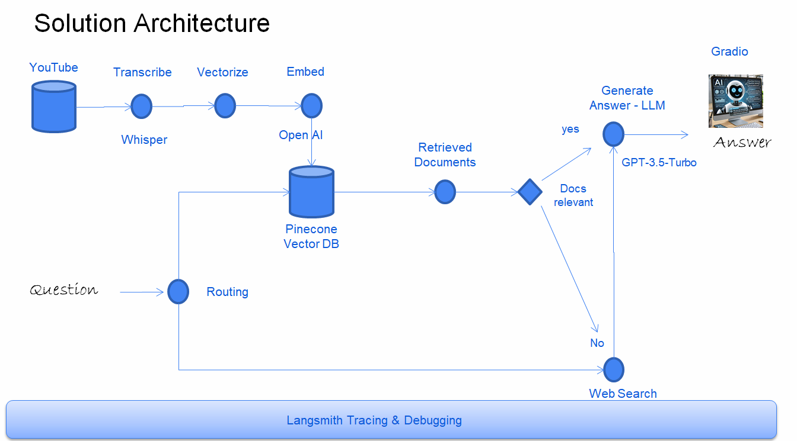

# Final Project | Earnings Q&A Chatbot

### Project Overview

This project builds a YouTube-based Q&A chatbot using Gradio, LangChain, Pinecone, and OpenAI. The chatbot provides answers about Accenture's quarterly earnings, revenue, 
and employee details, leveraging both internal document vectors and web search for responses. Users can update the information by adding new earnings reports to the dataset video_links.txt

### Table of Contents

   - Folder Structure
   - Environment Setup
   - Project Architecture   
   - Usage

### Folder Structure

- WIP-Notebooks/ - Contains all Jupyter notebooks used for experimentation and development of the project.
- main.py - Main script to run the chatbot.
- video_links.txt - Text file containing YouTube video links used in the project.
- README.md - Project documentation (this file).
- Final Project Presentation_Earnings QA Chatbot.pdf - Presentation slides for the Final Project.

### Environment Setup

1. Add your environment variables by setting up a .env file or using prompts in the script:
   - OPENAI_API_KEY: API key for OpenAI.
   - LANGCHAIN_API_KEY: API key for LangChain.
   - PINECONE_API_KEY: API key for Pinecone.
   - SERPAPI_API_KEY: API key for SerpAPI.
2. The script will securely request these keys if not already set in .env.

### Project Architecture

The chatbot uses the following architecture:

## Solution Architecture

- Data Retrieval: Combines a vector database (Pinecone) for structured data retrieval and SerpAPI for web search.
- Routing: Uses LangChain's ReAct agent to dynamically route user questions to the appropriate source (either vector store or web search) using Tools.
- Memory: ConversationBufferMemory maintains chat history for contextual, multi-turn conversations.
- LLM Integration: GPT-3.5-turbo processes user queries, generates responses, and summarizes search results, aided by ConversationBufferMemory and Chathistory function.

### Usage

- use requirements.txt to install the necessary packages
- Add video links to video_links.txt (one link per line).
- Run the script to generate transcriptions, create embeddings, and set up the chatbot interface.
- Interact with the chatbot by typing questions relevant to the video content.
- the script also generates a Gradio file locally.

